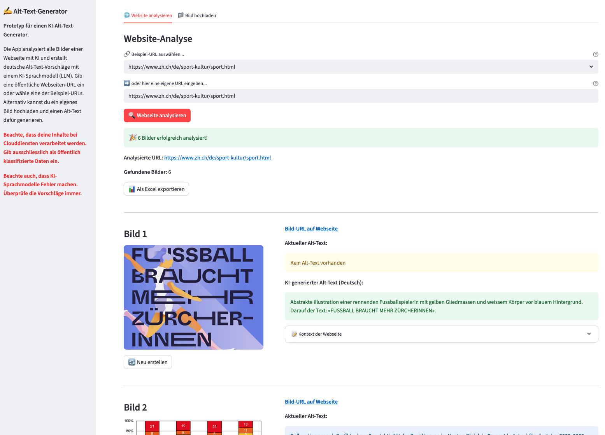

# Alt-Text-Generator KTZH

**Automagically generate German alt texts for web images using AI.**


[](https://github.com/machinelearningzh/alt-text-generator)
[](https://github.com/machinelearningZH/alt-text-generator/stargazers)
[](https://github.com/machinelearningZH/alt-text-generator/issues)
[](https://img.shields.io/github/issues-pr/machinelearningZH/alt-text-generator)
[](https://github.com/statistikZH/alt-text-generator)
<a href="https://github.com/astral-sh/ruff"></a>



## Features

- **Streamlit Web App and CLI Tool**: Input any URL to analyze all images
- **AI-powered Alt-Text Generation**: German alt-text using LLMs via OpenRouter
- **Context Analysis**: Considers image content, surrounding text (headings, paragraphs, captions) and existing alt-text
- **Excel Export**: Export all results as an Excel file
- **Parallel Processing**: Fast batch processing with configurable worker threads
- **Multiple Image Formats**: Support for JPEG, PNG, and WebP formats
- **Batch Processing of Multiple Web Pages**: CLI tool can process URL lists

## Installation

```bash
# Clone the repository
git clone https://github.com/statistikZH/alt-text-generator.git
cd alt-text-generator

# Install uv (if not already installed)
pip3 install uv

# Create virtual environment and install dependencies
uv venv
source .venv/bin/activate  # On macOS/Linux
# or .venv\Scripts\activate  # On Windows
uv sync
```

## Configuration

Configure the **environment variables**:

- The app automatically loads environment variables from `.env` or the configured path in `config.yaml`
- Set your OpenRouter API key:

```bash
export OPENROUTER_API_KEY="your_api_key_here"
```

Or create a `.env` file in the project root:

```
OPENROUTER_API_KEY=your_api_key_here
```

Currently, the application uses Google Gemini 2.5 Flash via OpenRouter. You can easily change this by simply inserting a different OpenRouter model ID in `config.yaml`.

## Usage

> [!WARNING]  
> Your data will be processed through [OpenRouter](https://openrouter.ai/) by third parties. Please ensure you only input non-sensitive information.

### Streamlit Web Interface

1. Start the Streamlit app:

```bash
streamlit run main.py
```

2. Open in browser (http://localhost:8501 by default)

### Command-Line Interface

The CLI provides various processing capabilities with four main commands:

#### Commands Overview

**Using the convenience script (recommended):**

```bash
# Generate alt-text for a single image
./generate-alt-text-cli single image.jpg

# Process multiple images from URL list of images
./generate-alt-text-cli batch urls.txt --output results.json

# Process all images from a webpage
./generate-alt-text-cli scrape https://example.com --output webpage_images.xlsx --format excel

# Batch process images from multiple webpages
./generate-alt-text-cli websites website_urls.txt --output all_websites.xlsx --format excel
```

**Direct usage with uv:**

```bash
uv run python _cli/cli.py single image.jpg --context "Swiss building in Zurich from 2025"
uv run python _cli/cli.py batch urls.txt --workers 10 --output results.json
```

#### Detailed Command Reference

##### `single` - Process a Single Image

Generate alt text for a single image file or URL.

```bash
./generate-alt-text-cli single <image> [options]
```

**Arguments:**

- `image` (required): Path to local image file or image URL

**Options:**

- `--context`, `-c`: Additional context information for the image (default: empty)
- `--alt-text`, `-a`: Existing alt text to improve upon (default: empty)

**Examples:**

```bash
./generate-alt-text-cli single photo.jpg
./generate-alt-text-cli single https://example.com/image.png --context "Swiss building in Zurich from 2025"
./generate-alt-text-cli single image.jpg --alt-text "Old description" --context "Swiss building in Zurich from 2025"
```

##### `batch` - Process Multiple Images from URL List

Process multiple images from a text file containing image URLs.

```bash
./generate-alt-text-cli batch <file> [options]
```

**Arguments:**

- `file` (required): Text file containing image URLs (one per line)

**Options:**

- `--context`, `-c`: Additional context for all images (default: empty)
- `--workers`, `-w`: Number of parallel workers (default: configured max_workers)
- `--output`, `-o`: Output file for results
- `--format`, `-f`: Output format, choices: `json`, `excel` (default: json)

**Examples:**

```bash
./generate-alt-text-cli batch image_urls.txt
./generate-alt-text-cli batch urls.txt --output results.json --workers 5
./generate-alt-text-cli batch urls.txt --context "Participants of an administration meeting" --format excel
```

##### `scrape` - Process Images from a Webpage

Scrape and process all images found on a specific webpage.

```bash
./generate-alt-text-cli scrape <url> [options]
```

**Arguments:**

- `url` (required): URL of the webpage to scrape for images

**Options:**

- `--workers`, `-w`: Number of parallel workers (default: configured max_workers)
- `--output`, `-o`: Output file for results
- `--format`, `-f`: Output format, choices: `json`, `excel` (default: json)

**Examples:**

```bash
./generate-alt-text-cli scrape https://example.com
./generate-alt-text-cli scrape https://example.com --output webpage_images.xlsx --format excel
./generate-alt-text-cli scrape https://example.com --workers 8 --output results.json
```

##### `websites` - Process Multiple Websites

Process images from multiple websites listed in a text file.

```bash
./generate-alt-text-cli websites <file> [options]
```

**Arguments:**

- `file` (required): Text file containing website URLs (one per line)

**Options:**

- `--workers`, `-w`: Number of parallel workers (default: configured max_workers)
- `--output`, `-o`: Output file for results
- `--format`, `-f`: Output format, choices: `json`, `excel` (default: json)

**Examples:**

```bash
./generate-alt-text-cli websites website_urls.txt
./generate-alt-text-cli websites sites.txt --output all_websites.xlsx --format excel
./generate-alt-text-cli websites urls.txt --workers 4 --output combined_results.json
```

#### Global Options

All commands support the following patterns:

- **Output formats**: Choose between JSON or Excel formats
- **Parallel processing**: Adjust the number of worker threads for faster processing
- **Context information**: Provide additional context to improve alt text quality

## Project Architecture

The project is organized into several core modules:

- **`_core/`**: Core functionality modules

  - `cli_processor.py`: Parallel processing of multiple images or web pages
  - `llm_processing.py`: AI-powered alt-text generation using OpenRouter
  - `web_scraper.py`: Web page analysis and image extraction
  - `exporter.py`: Export functionality (Excel, JSON)
  - `models.py`: Data models for image information
  - `config.py`: Configuration management
  - `logger.py`: Logging utilities
  - `prompts.py`: AI prompts for alt-text generation
  - `utils.py`: Utility functions
  - `app_info.py`: Configure UI text
  - `sample_urls.py`: Configure example URLs
  - `text_to_remove.py`: List of texts to remove from parsed content surrounding the image, e.g., text of navigational elements

- **`_cli/`**: Command-line interface

  - `cli.py`: Main CLI application

- **`_tests/`**: Test suite
- **`main.py`**: Streamlit web app
- **`config.yaml`**: Application configuration
- **`generate-alt-text-cli`**: Convenience script for CLI usage

## Project Information

This tool was developed for the cantonal administration to help content creators generate accessible alt-texts for web content. It is designed to create drafts for German alt-texts that comply with web accessibility standards.

## Project Team

- **Simone Luchetta, Hannes Weber** - [Team Informationszugang & Dialog, Staatskanzlei](https://www.zh.ch/de/staatskanzlei/digitale-verwaltung/team.html)
- **Céline Colombo** - [Koordinationsstelle Teilhabe, Statistisches Amt](https://www.zh.ch/de/politik-staat/teilhabe.html)
- **Chantal Amrhein**, **Patrick Arnecke** – [Statistisches Amt Zürich, Team Data](https://www.zh.ch/de/direktion-der-justiz-und-des-innern/statistisches-amt/data.html)

Thanks to **Corinna Grobe**, **Thomas Hofer** and **Roger Zedi** for their valuable contributions.

## Feedback and Contributing

We welcome feedback and contributions! [Email us](mailto:datashop@statistik.zh.ch) or open an issue or pull request.

### Development Setup

We use [`ruff`](https://docs.astral.sh/ruff/) for linting and formatting.

Install pre-commit hooks for automatic checks before committing:

```bash
pre-commit install
```

### Running Tests

```bash
# Run the test suite
uv run python -m pytest

# Run with coverage
uv run python -m pytest --cov=_core
```

## License

This project is licensed under the MIT License. See the [LICENSE](LICENSE) file for details.

## Disclaimer

This software incorporates AI models and has been developed according to and with the intent to be used under Swiss law. Please be aware that the EU Artificial Intelligence Act (EU AI Act) may, under certain circumstances, be applicable to your use of the software. You are solely responsible for ensuring that your use of the software as well as the underlying AI models complies with all applicable local, national and international laws and regulations. By using this software, you acknowledge and agree (a) that it is your responsibility to assess which laws and regulations, in particular regarding the use of AI technologies, are applicable to your intended use and to comply therewith, and (b) that you will hold us harmless from any action, claims, liability or loss in respect of your use of the software.
